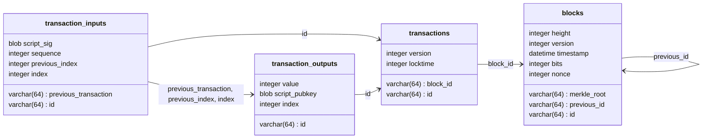

---
# You can also start simply with 'default'
theme: seriph
# random image from a curated Unsplash collection by Anthony
# like them? see https://unsplash.com/collections/94734566/slidev
background: https://cover.sli.dev
# some information about your slides (markdown enabled)
title: "Coincidence: A from scratch Bitcoin implementation"
# apply unocss classes to the current slide
class: text-center
# https://sli.dev/features/drawing
drawings:
  persist: false
# slide transition: https://sli.dev/guide/animations.html#slide-transitions
transition: slide-left
# enable MDC Syntax: https://sli.dev/features/mdc
mdc: true
---

# Coincidence

A from scratch Bitcoin implementation.

Reporter: [Mix](https://github.com/mnixry)

---

## 项目起名

项目起名为 Coincidence

- coin 开头，代表 Bitcoin

- 整个单词是「巧合」的意思，其实就是说我的项目能够恰巧工作起来，是一种巧合

如果感兴趣的话，可以去 GitHub 看看： <https://github.com/mix-archive/coincidence/>

---

## 项目目标

从零开始实现一个 Bitcoin 全节点

相比其他的学习项目，我的优势是：

- 用 Modern Python 实现
  - 有多 Modern？不支持 Python < 3.12
    - Python 3.10 的 Structural Pattern Matching
    - Python 3.12 的 [PEP 695](https://peps.python.org/pep-0695/)
  - 最前沿的静态类型推导和最严格的 Linter 规则
- 用 TDD 开发
  - 包含大量的单元测试和集成测试
  - 使用 BTC 真实区块链数据进行交叉测试

---

## 目前进度

- 完整的 Legacy Block Header
  - Merkle Tree 的计算
- UTXO 同步
- 交易序列化、反序列化、签名、验证
  - 几乎完整的 Script OpCode 实现
- 签名、验证

---

## 为什么没做完

- 考试周
- [PEP-341 Taproot](https://github.com/bitcoin/bips/blob/master/bip-0341.mediawiki), [BEP-141 Segregated Witness](https://github.com/bitcoin/bips/blob/master/bip-0141.mediawiki) 等新特性的支持
  - 非常前沿的密码学算法和特性，而且对 Block 和 Transaction 结构有很大的影响
    - Taproot: Schnorr 签名，Merkle Tree 的变化
    - Segregated Witness: 交易结构的变化
  - 不实现的话没有办法做完整的区块同步
- 网络协议序列化、反序列化
  - 实现起来有点麻烦，而且没有太多的测试数据
  - [BEP-324](https://github.com/bitcoin/bips/blob/master/bip-0324.mediawiki) 新增的 v2 版本的网络协议
- Proof of Work?
  - 一些历史遗留问题……

---

## 项目结构

- `src/coincidence`：Python 包
  - `block`：区块数据的定义和处理，包括 Merkle Tree
  - `crypto`：加密算法的实现，包括 secp256k1 ECDSA，HASH160 和 HASH256
  - `transaction`：交易数据的定义和处理
  - `utxo`：UTXO 数据的定义和处理

---

## 从密码学开始说起……

经典 Bitcoin 基于 secp256k1 的 ECDSA 签名算法来保证交易的安全性。

- Why secp256k1?
  > secp256k1 was almost never used before Bitcoin became popular, but it is now gaining in popularity due to its several nice properties. -- [Bitcoin Wiki](https://en.bitcoin.it/wiki/Secp256k1)
  - Satoshi Thinks NIST may have backdoors
    - ex. [Dual_EC_DRBG](https://en.wikipedia.org/wiki/Dual_EC_DRBG)
  - secp256k1 is a Koblitz curve
    - Good for efficient ECDSA signature verification (~30% faster)

---

同时，Satoshi 也设计了一种新的 Hash 算法：HASH160 和 HASH256

- $\text{HASH160}(x) = \text{RIPEMD160}(\text{SHA256}(x))$
- $\text{HASH256}(x) = \text{SHA256}(\text{SHA256}(x))$

Why hash twice?

- SHA256 is a Merkle-Damgård construction
  - Vulnerable to length extension attacks
- Bitcoin uses double SHA256 to prevent length extension attacks

Why RIPEMD160?

- Relatively short hash length and collision resistance
- Used in Bitcoin address generation
- Community support instead of NIST backed

---

## ……我们可以开始交易了……吗？

**Unique transaction structure in Bitcoin, a decentralized ledger system.**

UTXO: Unspent Transaction Output (未花费交易输出)

> We consider the scenario of an attacker trying to generate an alternate chain faster than the honest chain. Even if this is accomplished, it does not throw the system open to arbitrary changes, such as creating value out of thin air or taking money that never belonged to the attacker. -- [Bitcoin Whitepaper](https://bitcoin.org/bitcoin.pdf)

- _A.Back: Hashcash proposal_ (1997)
  - First idea of using PoW to prevent double spending
- _H.Finney "Reusable Proof of Work"_ (2004)
- Finally, Satoshi proposed the UTXO model in Bitcoin whitepaper (2008).

What is UTXO?

- A transaction output is a tuple $(\text{txid}, \text{index}, \text{value}, \text{scriptPubKey})$
- A transaction input is a tuple $(\text{txid}, \text{index}, \text{scriptSig})$
- A UTXO is a transaction output that has not been spent yet.

---

## 所以，我们需要先理解交易的结构……

{width=300px}

```text
010000000110ddd830599b17cc690535f7df28a84466eaca3c22f0d55b79023b6570f4fbc501000
0008b483045022100e6186d6f344ce4df46b2e15d87093d34edbf5b50462b6b45f9bd499a6a62fb
c4022055f56a1c4a24ea6be61564593c4196b47478a25cf596c1baf59f5a9a229b637c014104a41
e997b6656bc4f5dd1f9b9df3b4884cbec254d3b71d928587695b0df0a80417432f4ca6276bc620b
1f04308e82e70015a40f597d8260912f801e4b62ab089effffffff0200e9c829010000001976a91
46f34d3811aded1df870359f311c2a11a015e945388ac00e40b54020000001976a91470d6734de6
9c1ac8913892f2df9be0e738d26c2d88ac00000000
```

WTF is this?

---

```python
@dataclass(frozen=True)
class TransactionInput:
    previous_transaction: bytes
    """Previous transaction SHA256 hash"""
    previous_index: int
    """UTXO index in the previous transaction"""
    script_signature: BaseTransactionScript | None = None
    """Unlocking script"""
    sequence: int = 0xFFFFFFFF

@dataclass(frozen=True)
class TransactionOutput:
    value: int
    """Value in satoshis (1 BTC = 100_000_000 satoshis)"""
    script_pubkey: BaseTransactionScript
    """Locking script"""

@dataclass(frozen=True)
class Transaction:
    version: int
    inputs: tuple[TransactionInput, ...]
    outputs: tuple[TransactionOutput, ...]
    locktime: int
    """Block height or timestamp at which this transaction is valid"""
```

---

## 交易的验证

How to do transaction verification?

- Script is a language executed in a stack-based virtual machine

  - Push data to stack
  - Execute opcodes
  - Pop data from stack

- Execute $\text{Script} = \text{scriptSig} + \text{scriptPubKey}$
  - If and only if the script stack has only one element and it is not zero, the transaction is valid.
  - Otherwise, the transaction is invalid.

Script is designed not to be Turing complete, so its execution is guaranteed to terminate. Some other bytecodes are also follows this rule, ex. eBPF in Linux kernel.

So, yes, the "smart contract" feature has been there since the beginning of Bitcoin.

---

### Script：通用的格式们

P2PK: Pay to Public Key

- ScriptPubKey: `<pubkey> OP_CHECKSIG`
- ScriptSig: `<signature>`
- Problems: Public key is exposed in the blockchain

P2PKH: Pay to Public Key Hash

- ScriptPubKey: `OP_DUP OP_HASH160 <pubkey_hash> OP_EQUALVERIFY OP_CHECKSIG`
- ScriptSig: `<signature> <pubkey>`
- Problems: Public key is still exposed in the blockchain after transaction is spent

Coinbase Transaction

- ScriptSig: `<height> <random_bytes>` (height after BIP-34)

This is a textbook styled polymorphic example if we want to deserialize a script to different types of scripts.

---

### Script Parser: Python 实现

I have implemented a polymorphic script parser in Coincidence. It can dispatch the bytecode to different script types and deserialize it to the correct type.

```python
@classmethod
def deserialize(
    cls, reader: IO[bytes], flags: ScriptDeserializationFlag
) -> "BaseTransactionScript":
    bytecode = read_script_bytecode(reader)
    for dispatch in cls.__subclasses__():
        if dispatch is CommonTransactionScript:
            continue
        if script := dispatch.from_bytecode(bytecode, flags):
            return script
    return CommonTransactionScript(bytecode)
```

```python
>>> hash160 = bytes([0] * 20)
>>> script = PayToPublicKeyHashScript(hash160)
>>> serialized = script.serialize()
>>> deserialized = BaseTransactionScript.deserialize(
...     BytesIO(serialized), ScriptDeserializationFlag.FROM_OUTPUT
>>> )
>>> assert isinstance(deserialized, PayToPublicKeyHashScript)
>>> assert deserialized.hash160 == hash160
```

---

### Script VM: Python 实现

Problem: Some VM instructions requires more states than just the stack.

Solution: Dependency Injection based on function signature.

```python
def register_op(*ops: TransactionOpCode):
    def decorator[T: OpCodeCallback](func: T) -> T:
        signature = inspect.signature(func)
        flags = OpCodeInstructArguments.stack
        try:
            for arg in signature.parameters:
                flags |= OpCodeInstructArguments[arg]
        except KeyError as e:  # pragma: no cover
            raise ValueError(f"Invalid arguments: {signature}") from e
        for op in ops:
            if conflicted := _TRANSACTION_OP_TABLE.get(op):  # pragma: no cover
                raise ValueError(f"Conflicting opcode: {op=} {conflicted=} {func=}")
            _TRANSACTION_OP_TABLE[op] = (func, flags)
        return func
    return decorator

@register_op(TransactionOpCode.OP_IF, TransactionOpCode.OP_NOTIF)
def op_if(stack: Stack, cmds: Commands, current_op: TransactionOpCode):
    ...
```

---

## 提交一个交易!

Hence we have fully implemented the transaction structure and the script execution engine. We can now submit a transaction to the network.

1. Claim a UTXO
   - Use faucet of Testnet4
2. Create a transaction
3. Submit the transaction to the network

```python
private_key = BitcoinPrivateKey.from_wif(....)
tx_in = TransactionInput(previous_transaction=b"...",previous_index=1,)
tx_out = (TransactionOutput(value=3000,
        script_pubkey=PayToPublicKeyHashScript.from_address("mwJn1YPMq7y5F8J3LkC5Hxg9PHyZ5K4cFv"),),
    TransactionOutput(value=1500,
        script_pubkey=PayToPublicKeyHashScript.from_address("mgPyDZCBtc2eKGQJ5ZTATyJ6zPnGhSuGjP"),),)
tx = Transaction(version=1, inputs=tx_in, outputs=tx_out, locktime=0)
prev_script = CommonTransactionScript(b"...")
hash_ = tx.signature_hash(0, prev_script)
signature = sign_transaction(hash_, private_key) + SignatureHashTypes.ALL.to_bytes(1, "big")
signed_tx = tx.replace_input_script(0, SignatureScript(signature, private_key.public_key()))
assert signed_tx.id.hex()== "af1324f6ab2b35d899164fd4aef74d1369dabddc702a03b75e5b28dd5603727b"
```

---

### 看看交易

<https://mempool.space/testnet4/tx/af1324f6ab2b35d899164fd4aef74d1369dabddc702a03b75e5b28dd5603727b>

{width=450px}

---

## 接下来是……区块

区块是 Bitcoin 的基本单位，是一个包含多个交易的数据结构。也就是「区块链」的「区块」。

{width=350px}

---

### 区块头

- Version: 区块版本号
- Previous Block: 上一个区块的 HASH256
- Merkle Root: 交易的 Merkle Tree 根节点
- Timestamp: 区块生成时间
- Bits: 难度目标
- Nonce: 随机数

```python
@dataclass(frozen=True)
class Block:
    version: int
    previous_block: bytes
    merkle_root: bytes
    timestamp: datetime
    bits: int
    nonce: int
```

---

### Extra block properties

```python
    @property
    def features(self):
        if not self.version & 0x20000000:
            return VersionLegacy(self.version)
        recognizable_flags = VersionBitFlags(0)
        for flag in VersionBitFlags:
            if self.version & flag:
                recognizable_flags |= flag
        return recognizable_flags

    @property
    def hash(self) -> bytes:
        return sha256(sha256(self.serialize()))[::-1]

    @property
    def target(self) -> bytes:
        exponent = self.bits >> 24
        coefficient = self.bits & 0x00FFFFFF
        return (coefficient << (8 * (exponent - 3))).to_bytes(32, "big")

    @property
    def difficulty(self) -> float:
        return 0xFFFF * 2 ** (8 * (0x1D - 3)) / int.from_bytes(self.target, "big")
```

---

### Proof of Work

TL;DR: Change the nonce until fount the `block.hash < block.target`.

Target are defined as:

$$
\text{target} = \text{coefficient} \times 2^{8 \times (\text{exponent} - 3)}
$$

Where `coefficient` and `exponent` are extracted from `block.bits`.

{width=150px}

The difficulty will be dynamically adjusted by the network to keep the block generation time around 10 minutes. The adjustment is done every 2016 blocks, which is around 2 weeks. If the block generation time is less than 10 minutes, the difficulty will be increased. Otherwise, the difficulty will be decreased.

---

#### 一些历史遗留问题……

- Nonce 字段太短了！32 位整数，最多只能尝试 $2^{32}$ 次，现在 BTC 主网的难度早已经超过了 $2^{60}$ 次
- 为什么不用更长的随机数？
  - Satoshi 没有想到会有这么多的算力（摩尔定律！）
    > I think that Satoshi thought that a 32 bit nonce-space was overkill. A standard computer, like the one I am writing this on, can get about 3 MH/s, which is about 0.07% of the way through a single nonce-range before you can increment nTime and get a whole new range of nonces. -- [StackExchange](https://bitcoin.stackexchange.com/questions/32603)
  - 也没有想到会有 ASIC 矿机和矿池

FYI, my laptop can do about 538MH/s on HASH256 (by `hashcat -b -m 21400`):

```text
OpenCL API (OpenCL 2.1 AMD-APP.dbg (3625.0)) - Platform #1 [Advanced Micro Devices, Inc.]
=========================================================================================
* Device #2: AMD Radeon 680M, 6880/13871 MB (5895 MB allocatable), 6MCU
* Hash-Mode 21400 (sha256(sha256_bin($pass)))
Speed.#2.........:   538.8 MH/s (91.66ms) @ Accel:1024 Loops:256 Thr:32 Vec:1
```

So it can brute $2^{32}$ nonces in about 7s. They introduced `extraNonce` field in coinbase transaction to extend the nonce space. I personally think it's a hacky solution. So I postponed the PoW implementation.

---

#### Merkle Tree

{width=500px}

A merkle root is created by hashing together pairs of TXIDs to get a short and unique fingerprint for all the transactions in a block.

This merkle root is placed in a block header to prevent the contents of the block from being tampered with later on. So if someone tries to add or remove a transaction from the block, the merkle root for the transactions inside the block will no longer match the merkle root inside the block header.

In other words, the merkle root is what connects the block header to the transactions in the block.

---

#### Merkle Tree: Python 实现

```python {*}{maxHeight:'65vh'}
class ProofPosition(IntEnum):
    LEFT = auto()
    RIGHT = auto()


@dataclass(frozen=True)
class MerkleTree:
    pair: MerkleTreePair

    def proof(self, target: bytes) -> list[tuple[bytes, ProofPosition]] | None:
        if target not in self:
            return None
        match self.pair:
            case bytes():
                return []
            case (bytes(left), bytes(right)) if left == target:
                return [(right, ProofPosition.RIGHT)]
            case (bytes(left), bytes(right)):
                return [(left, ProofPosition.LEFT)]
            case (left, right) if (found := left.proof(target)) is not None:
                return [*found, (right.hash, ProofPosition.RIGHT)]
            case (left, right) if (found := right.proof(target)) is not None:
                return [*found, (left.hash, ProofPosition.LEFT)]
            case _:  # pragma: no cover
                raise ValueError("Invalid state")

    @cached_property
    def hash(self) -> bytes:
        match self.pair:
            case bytes(hash_):
                return hash_
            case (bytes(left), bytes(right)):
                return sha256(sha256(left + right))
            case (left, right):
                return sha256(sha256(left.hash + right.hash))

    @cached_property
    def hashes(self) -> frozenset[bytes]:
        match self.pair:
            case bytes(hash_):
                return frozenset([hash_])
            case (bytes(left), bytes(right)) as pair:
                return frozenset(pair)
            case (left, right):
                return left.hashes | right.hashes

    def __contains__(self, hash_: bytes) -> bool:
        return hash_ in self.hashes

    @classmethod
    def from_hashes(cls, hashes: list[bytes] | list[Self]) -> Self:
        match hashes:
            case []:
                raise ValueError("Cannot compute merkle root of empty list")
            case [bytes(hash1)]:
                return cls(hash1)
            case [hash1, hash2]:
                return cls(cast(MerkleTreePair, (hash1, hash2)))
            case [*rest]:
                nodes = [
                    cls(cast(MerkleTreePair, pair))
                    for pair in zip_longest(rest[::2], rest[1::2], fillvalue=rest[-1])
                ]
                return cls.from_hashes(nodes)
```

---

## Transaction & Block Synchronization

Different from Bitcoin Core uses LevelDB (a key-value store developed by Google), I use relational database to store UTXO data. The relational database operation interface is built on the top of SQLAlchemy ORM, which give us a really nice cross-database compatibility.

Currently, the UTXO database is tested to support PostgreSQL and SQLite3.



Thus we can easily query the UTXO data and the block data in a single SQL query. Which makes the possibility of implementing a Full Node in the future.

---

### Synchonization: Python 实现

```python {*}{maxHeight:'65vh'}
@wrap_transaction
def insert_block(session: Session, height: int, block: Block):
    block_obj = schema.Blocks(
        id=block.hash,
        merkle_root=block.merkle_root,
        height=height,
        version=block.version,
        timestamp=block.timestamp,
        bits=block.bits,
        nonce=block.nonce,
        previous_id=block.previous_block[::-1] if height > 0 else None,
    )
    session.add(block_obj)
    return block_obj


@wrap_transaction
def insert_transactions(
    session: Session, block_id: bytes, transactions: Sequence[Transaction]
):
    duplicated = set(
        session.scalars(
            select(schema.Transactions.id).filter(
                schema.Transactions.id.in_(t.id for t in transactions)
            )
        )
    )
    txs: list[schema.Transactions] = []
    for transaction in transactions:
        if transaction.id in duplicated:
            continue
        transaction_obj = schema.Transactions(
            id=transaction.id,
            block_id=block_id,
            version=transaction.version,
            locktime=transaction.locktime,
        )
        txs.append(transaction_obj)
    session.bulk_save_objects(txs)
    txs_io: dict[
        bytes, tuple[list[schema.TransactionInputs], list[schema.TransactionOutputs]]
    ] = {}
    for transaction in transactions:
        if transaction.id in duplicated:
            continue
        txi = insert_transaction_inputs(session, transaction, transaction.inputs)
        txo = insert_transaction_outputs(session, transaction, transaction.outputs)
        txs_io[transaction.id] = (txi, txo)
    return [(tx, txs_io.get(tx.id)) for tx in txs]


@wrap_transaction
def insert_transaction_inputs(
    session: Session, transaction: Transaction, inputs: Sequence[TransactionInput]
):
    tx_inputs: list[schema.TransactionInputs] = []
    for index, tx_input in enumerate(inputs):
        transaction_input = schema.TransactionInputs(
            id=transaction.id,
            index=index,
            script_sig=(
                tx_input.script_signature.bytecode
                if tx_input.script_signature
                else None
            ),
            sequence=tx_input.sequence,
            previous=None,
        )
        if not transaction.is_coinbase:
            transaction_input.previous_transaction = tx_input.previous_transaction[::-1]
            transaction_input.previous_index = tx_input.previous_index
        tx_inputs.append(transaction_input)
    session.bulk_save_objects(tx_inputs)
    return tx_inputs


@wrap_transaction
def insert_transaction_outputs(
    session: Session, transaction: Transaction, outputs: Sequence[TransactionOutput]
):
    tx_outputs: list[schema.TransactionOutputs] = []
    for index, tx_output in enumerate(outputs):
        transaction_output = schema.TransactionOutputs(
            id=transaction.id,
            index=index,
            value=tx_output.value,
            script_pubkey=tx_output.script_pubkey.bytecode,
        )
        tx_outputs.append(transaction_output)
    session.bulk_save_objects(tx_outputs)
    return tx_outputs
```

---

## 未来计划

- 实现网络协议
  - 从 P2P 到 HTTP
  - 从 v1 到 v2
- 实现 Proof of Work

谢谢！
